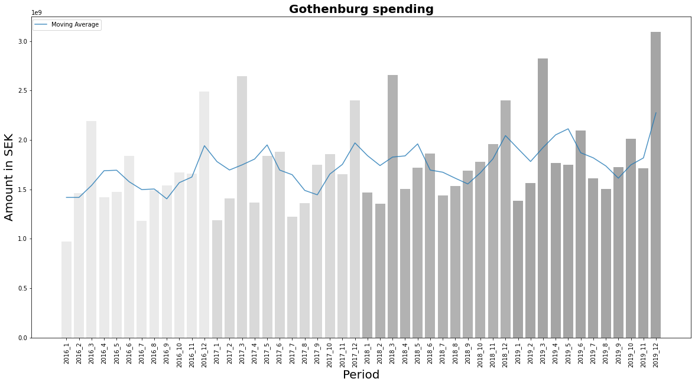

```python
import pandas as pd
import functions
import matplotlib.pyplot as plt
from matplotlib.ticker import MaxNLocator
df = pd.read_csv('data.csv')
```

    C:\Users\anton\Documents\Anaconda3\envs\gbg_invoice\lib\site-packages\IPython\core\interactiveshell.py:3146: DtypeWarning: Columns (3) have mixed types.Specify dtype option on import or set low_memory=False.
      has_raised = await self.run_ast_nodes(code_ast.body, cell_name,
    


```python
### Data-processing

df_time = df.groupby(['year', 'month'])['belopp'].agg(['sum', 'count']).reset_index()
df_time['period'] = df_time[['year', 'month']].apply(lambda x: '_'.join(x.astype(str)), axis = 1)

#df_time.to_csv('df_yy_mm.csv',index = False)

values = np.array(df_time['sum'])
idx = np.array(df_time['period'])


### Color on bar charts

color_list = []
        
for period in idx:
    year = period[0:4]
    if year == '2016':
        color_list.append('gainsboro')
    elif year == '2017':
        color_list.append('silver')
    elif year == '2018':
        color_list.append('grey')
    else:
        color_list.append('dimgray')


### Rolling Means

months = 3

rolling_windows = df_time['sum'].rolling(months)
rolling_mean = rolling_windows.mean().fillna(df_time['sum'][months])
#print(rolling_mean)

### Plotting

plt.figure(figsize=(20,10))

plt.plot(rolling_mean, alpha = 0.8, label = 'Moving Average')
plt.bar(idx,values, color = color_list, alpha = 0.6)
plt.xlabel('Period', fontsize = '20')
plt.xticks(rotation = 90)
plt.ylabel('Amount in SEK', fontsize = '20')
plt.title('Gothenburg spending', fontsize = '20', fontweight = 'bold')
plt.legend(bbox_to_anchor=(-0.39,0.5,0.5,0.5))
```


    <matplotlib.legend.Legend at 0x1c49c9cd790>


    

    

